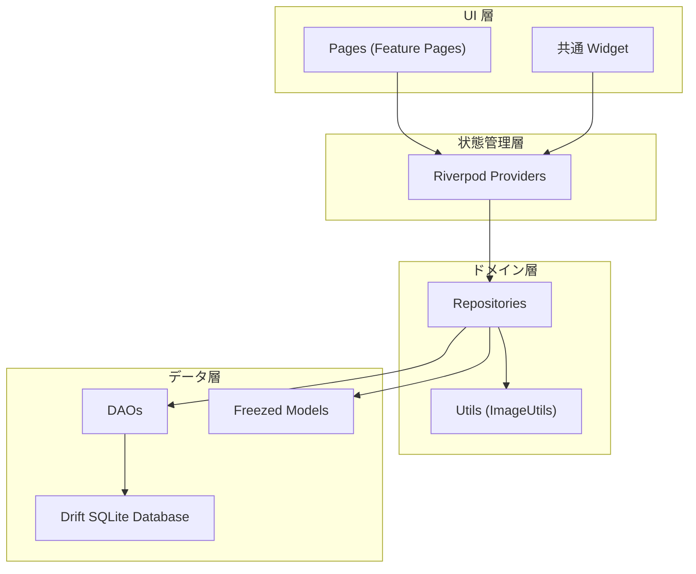
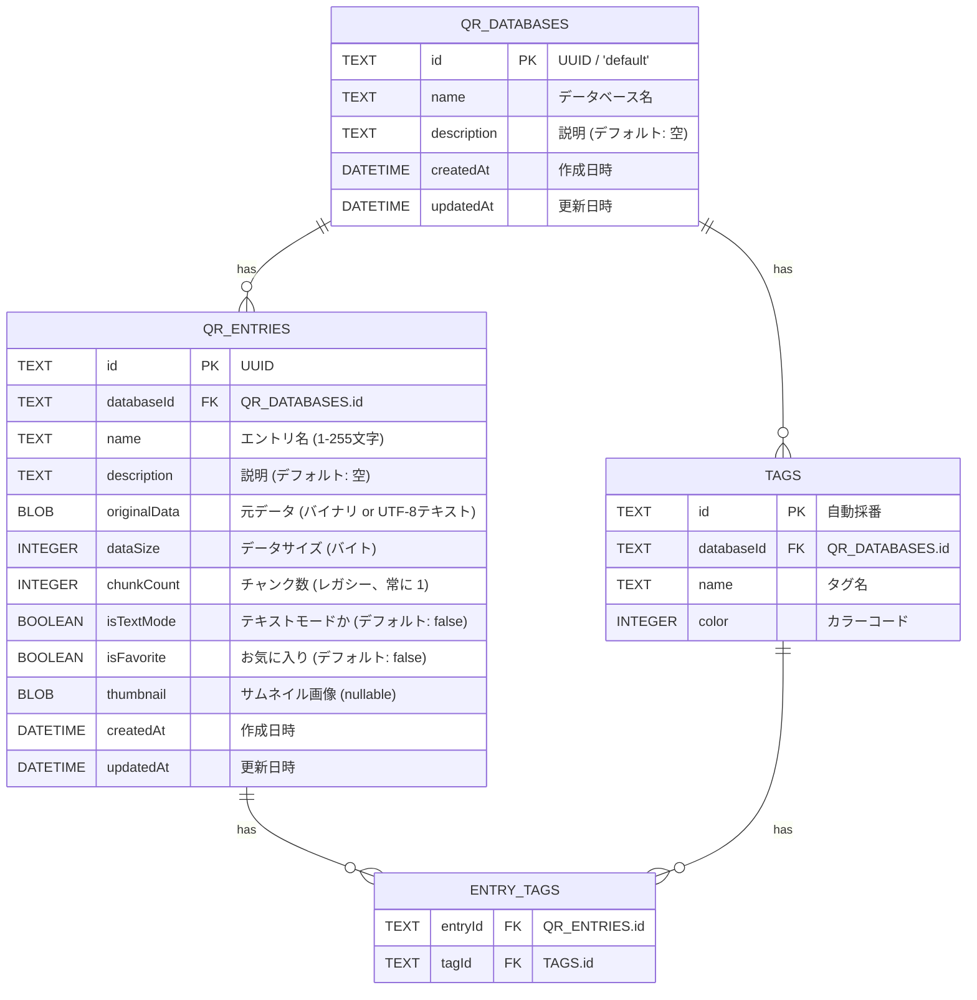
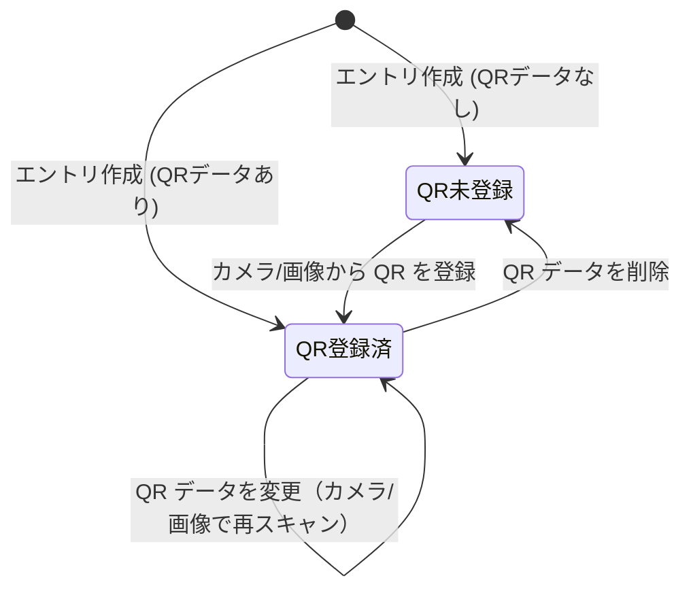
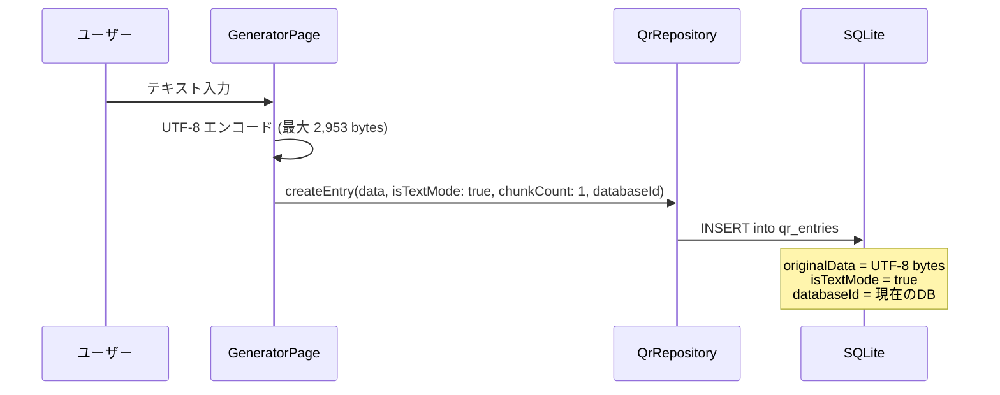
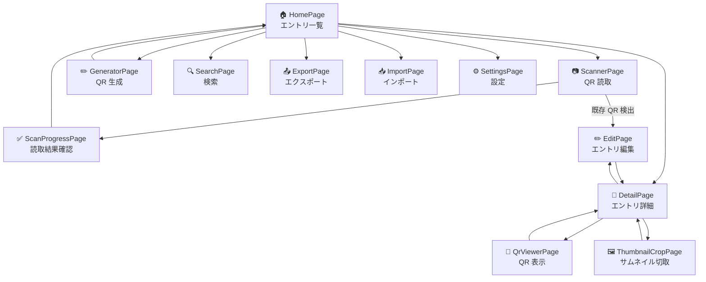
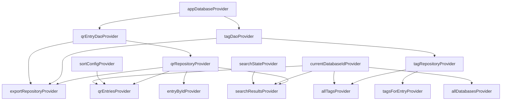
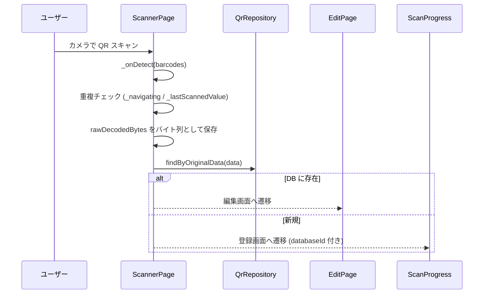
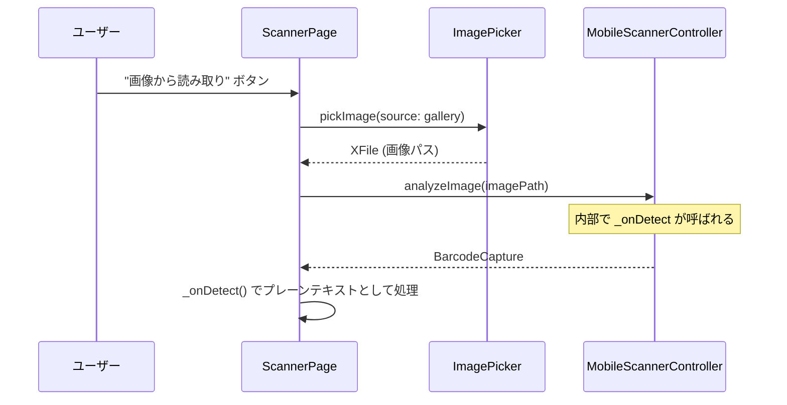
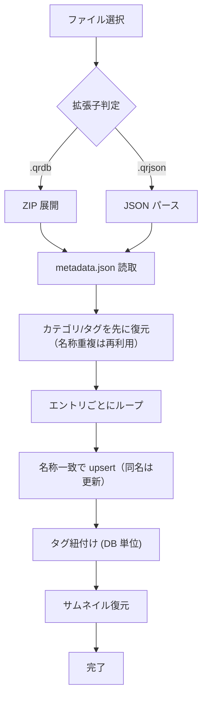
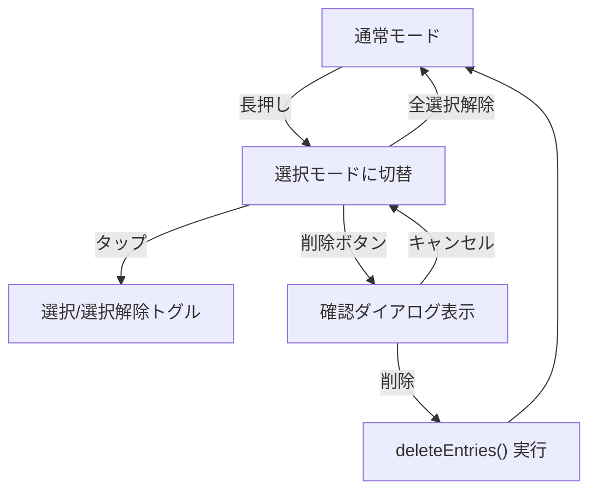

# プリQR 設計書

## 1. 概要

プリQR は、テキストやファイルを QR コードに変換・管理し、カメラや画像ファイルから QR コードを読み取って復元するクロスプラットフォームÍÍÍ Flutter アプリケーションです。

### 主要機能

| 機能 | 説明 |
|------|------|
| **QR 生成（テキスト）** | テキスト入力を標準互換 QR コードに変換（最大 2,953 バイト） |
| **QR 生成（ファイル）** | ファイルを QR コードに変換（テキストとして扱い最大 2,953 バイト） |
| **QR 読み取り（カメラ）** | カメラからリアルタイムで QR コードを読み取り |
| **QR 読み取り（画像）** | ギャラリーの画像から QR コードを読み取り |
| **データ管理** | 読み取り・生成した QR エントリをサムネイル付きで一覧管理 |
| **マルチデータベース** | 目的別にデータベースを複数作成し、エントリを論理的にグループ化 |
| **QR 未登録エントリ** | QR データなしでエントリを作成し、あとから QR を登録・更新・削除可能 |
| **一括選択・削除** | ホーム画面で長押しによる複数選択モード、確認ダイアログ付き一括削除 |
| **カテゴリ管理** | カテゴリ作成・編集・削除・並び替え、エントリへのカテゴリ割当、ホーム画面でカテゴリ別アコーディオン表示（展開中カテゴリ見出しのみピン止め。カテゴリ末尾到達時は次の展開カテゴリへピン止めが引き継がれる） |
| **ソート** | 名前順・作成日時順・更新日時順 (昇順/降順) でエントリを並べ替え |
| **お気に入り** | エントリをお気に入り登録し、ホーム画面で折り畳み可能な専用セクションで優先表示 |
| **ホーム操作性向上** | ホーム上部にお気に入り/カテゴリの一括開閉ボタン、下部右側に検索ショートカットを配置 |
| **詳細画面操作性向上** | 詳細画面下部に固定アクション（QR表示/URL起動/情報編集）を常時表示し、中央左右のフローティングボタンでも前後移動が可能。共有画像は「名称 + 任意サムネイル + 余白付きQR」を合成した PNG を出力 |
| **QR生成の高度設定** | 設定画面のアコーディオンで誤り訂正レベル・余白・ギャップレス描画を変更し、QR描画に反映 |
| **QR 表示サイズ調整** | QR コードの表示サイズを大・中・小プリセットまたはスライダーで自由に変更（表示中の変更はその画面内のみ有効） |
| **PWA ホーム追加** | Web 版の QR 表示画面から「ホーム画面に追加」導線を実行可能 |
| **QR 再現性** | スキャン時の rawBytes をそのまま保存し、再表示時に元の QR を忠実に再現 |
| **重複QR検出** | スキャン済みの QR が DB に存在する場合は編集画面へ自動遷移 |
| **タグ管理** | エントリにタグを付与して分類・検索（タグ名でも全文検索可能）。タグ選択UIは高さ制限 + 内部スクロールでコンパクト表示。設定画面でタグ名変更・削除が可能。DB跨ぎ紐付けは防止 |
| **検索フィルタ** | 初期表示は全件、名称・説明・タグ名・QR登録状態で絞り込み |
| **エクスポート/インポート** | ZIP (`.qrdb`) / JSON (`.qrjson`) 形式でDB単位のバックアップ・復元（カテゴリ対応、同名upsert）。処理中は画面操作をロックし、進捗（処理件数/総件数）とプロセス表示、ユーザーキャンセルに対応。Export対象をタグ/カテゴリ/テキスト条件でフィルタ可能 |
| **クラウドバックアップ導線** | OneDrive へ直接保存/復元を提供。MSAL による Microsoft 推奨フローで認証し、トークンは secure storage とネイティブキャッシュで扱い、Microsoft Graph API で保存・一覧・復元を実行。Apple 側の本番 bundle identifier は `jp.co.geroneko.priqr` とし、MSAL redirect URI は `msauth.jp.co.geroneko.priqr://auth` を前提にする。Android の MSAL authority は `PersonalMicrosoftAccount` と `consumers` endpoint を使い、broker を使わず、要求スコープは `Files.ReadWrite.AppFolder` のみを明示する。保存先は OneDrive の `Apps/<アプリ登録名>` 配下のアプリ専用フォルダ。対応は Android / iOS / macOS。Google Drive / iCloud 連携は削除 |
| **設定** | テーマ切替（ライト/ダーク/システム連動）、データベース管理（新規作成・リネーム・削除）、タグ管理（リネーム・削除）、アプリバージョン表示（`pubspec.yaml` の version と連動） |

### 対応プラットフォーム

Android / iOS / macOS / Windows / Linux / Web

> **注意**: 画像ファイルからの QR 読み取り（`analyzeImage`）は Web では非対応です。
>
> **注意**: Web のローカルDBは drift + WASM（`web/sqlite3.wasm`, `web/drift_worker.js`）で動作します。OneDrive 連携は Android / iOS / macOS のみ対応で、Web では非表示です。
>
> **注意**: Web の DB はブラウザ内ストレージへ永続化されるため通常は都度インポート不要ですが、ブラウザデータ削除やシークレットモードでは保持されない場合があります。

---

## 2. 技術スタック

| カテゴリ | パッケージ | バージョン | 用途 |
|----------|-----------|-----------|------|
| フレームワーク | Flutter | 3.x | UI フレームワーク |
| 言語 | Dart SDK | ^3.11.3 | 開発言語 |
| 状態管理 | flutter_riverpod | ^3.3.1 | Provider ベースの状態管理 |
| 状態管理 (codegen) | riverpod_generator | ^4.0.3 | `@riverpod` によるコード生成 |
| ルーティング | auto_route | ^11.1.0 | 型安全な画面遷移 |
| モデル | freezed | ^3.2.5 | イミュータブルモデル生成 |
| シリアライズ | json_serializable | ^6.13.0 | JSON 変換 |
| データベース | drift | ^2.31.0 | SQLite ORM |
| データベース (Flutter) | drift_flutter | ^0.2.8 | Flutter 向け drift バインディング |
| QR 生成 | qr_flutter | ^4.1.0 | QR コード画像の描画 |
| QR 読取 | mobile_scanner | ^7.2.0 | カメラ / 画像からの QR 読取 |
| 画像加工 | crop_your_image | ^2.0.0 | サムネイルの切り取り |
| 画像処理 | image | ^4.8.0 | リサイズ・変換 |
| 画像選択 | image_picker | ^1.2.1 | ギャラリーからの画像選択 |
| ファイル選択 | file_picker | ^10.3.10 | ファイル選択ダイアログ |
| D&D | desktop_drop | ^0.7.0 | デスクトップのドラッグ&ドロップ |
| アーカイブ | archive | ^4.0.9 | ZIP 圧縮・展開 |
| 共有 | share_plus | ^12.0.1 | OS ネイティブの共有機能 |
| Microsoft 認証 | msal_auth | ^3.3.0 | OneDrive 向け MSAL 認証 |
| UUID | uuid | ^4.5.3 | エントリ/DB の ID 生成 |

---

## 3. アーキテクチャ

### レイヤ構成



### ディレクトリ構造

```
lib/
├── main.dart                     # エントリポイント
├── app.dart                      # MaterialApp 構成
├── core/
│   ├── constants/
│   │   └── app_constants.dart    # 定数定義
│   ├── theme/
│   │   └── app_theme.dart        # Material 3 テーマ
│   └── utils/
│       └── image_utils.dart      # 画像リサイズ（アスペクト比保持、最大幅 512px）
├── data/
│   ├── database/
│   │   ├── app_database.dart     # Drift DB 定義 (スキーマ v4)
│   │   ├── daos/
│   │   │   ├── qr_entry_dao.dart # QR エントリ DAO
│   │   │   └── tag_dao.dart      # タグ DAO
│   │   └── tables/
│   │       ├── qr_databases.dart # データベーステーブル (v4 追加)
│   │       ├── qr_entries.dart   # エントリテーブル (databaseId FK 追加)
│   │       ├── qr_chunks.dart    # チャンクテーブル（レガシー）
│   │       ├── tags.dart         # タグテーブル (databaseId 追加)
│   │       └── entry_tags.dart   # エントリ-タグ中間テーブル
│   ├── models/
│   │   └── qr_entry_model.dart   # Freezed モデル (QrDatabaseModel, QrEntryModel, TagModel)
│   └── repositories/
│       ├── qr_repository.dart    # QR CRUD (DB単位、QRデータ更新/削除、一括削除)
│       ├── tag_repository.dart   # タグ CRUD (DB単位)
│       └── export_repository.dart# エクスポート/インポート (DB単位)
├── features/
│   ├── detail/
│   │   ├── detail_page.dart      # エントリ詳細 (下部固定アクション、左右スワイプ/ボタン遷移、QR未登録状態対応)
│   │   └── edit_page.dart        # エントリ編集 (QRデータ登録/変更/削除)
│   ├── export_import/
│   │   ├── export_page.dart      # エクスポート (現在のDB単位)
│   │   └── import_page.dart      # インポート (現在のDB単位)
│   ├── generator/
│   │   └── generator_page.dart   # QR 生成 (現在のDB単位)
│   ├── home/
│   │   └── home_page.dart        # ホーム一覧 (一括選択/削除、ソート、DB切替、アコーディオン一括開閉、下部検索ショートカット)
│   ├── scanner/
│   │   ├── scanner_page.dart     # QR 読取 (プレーンテキスト専用)
│   │   └── scan_progress_page.dart # 読取結果確認 (現在のDB単位)
│   ├── search/
│   │   └── search_page.dart      # 検索 (タグ名検索、QRステータスフィルタ)
│   ├── settings/
│   │   └── settings_page.dart    # 設定（表示設定、DB/カテゴリ/タグ管理、QR生成高度設定）
│   ├── thumbnail/
│   │   └── thumbnail_crop_page.dart # サムネイル切取 (1:1/自由アスペクト比)
│   └── viewer/
│       └── qr_viewer_page.dart   # QR 表示
├── providers/
│   └── providers.dart            # Riverpod Provider 定義 (DB切替、ソート、検索)
├── router/
│   └── app_router.dart           # auto_route ルート定義
└── widgets/
    ├── platform_utils.dart       # プラットフォーム判定
    ├── qr_entry_card.dart        # エントリカード (選択状態、QR未登録グレーアウト)
    └── tag_chips.dart            # タグチップ
```

---

## 4. データベーススキーマ

**スキーマバージョン: 4**

### ER 図



### マイグレーション履歴

| バージョン | 変更内容 |
|-----------|---------|
| 1 | 初期スキーマ (qr_entries, qr_chunks, tags, entry_tags) |
| 2 | `qr_entries` に `isTextMode` カラム追加 (BOOLEAN, デフォルト: false) |
| 3 | `qr_entries` に `isFavorite` カラム追加 (BOOLEAN, デフォルト: false) |
| 4 | `qr_databases` テーブル追加、`qr_entries`/`tags` に `databaseId` FK 追加、デフォルト DB 自動作成 |

---

## 5. QR コードの動作モード

アプリはすべての QR データを **プレーンテキスト** として扱います。スキャン時には `rawDecodedBytes` をそのまま保存し、再表示時には UTF-8 → Latin-1 の順にデコードを試みることで、元の QR コードを忠実に再現します。

### 動作モード

| 項目 | 説明 |
|------|------|
| 入力ソース | テキスト入力 / ファイル選択 / D&D / カメラ読取 / 画像読取 |
| 最大サイズ | 2,953 バイト (QR Version 40 / ECC-L) |
| QR 互換性 | **標準 QR リーダーで読取可** |
| チャンク数 | 常に 1 |
| 保存データ | スキャン時の rawDecodedBytes (バイト列) |
| QR 未登録 | `originalData` が空 (`dataSize == 0`)。あとから編集画面で登録可能 |

### QR データの状態遷移



### テキスト生成のフロー



### ファイル読み込みのフロー


---

## 6. レガシー: チャンクプロトコル (QC Protocol)

> **削除済み**: 独自チャンクプロトコル (`QrChunker` クラス、`qr_chunks` テーブル定義、関連メソッド) はコードベースから完全に削除されました。
>
> `qr_chunks` テーブルは過去のマイグレーションで作成された物理テーブルが DB 内に残りますが、drift モデルからは除外されており、アプリ話で一切参照されません。

---

## 7. 画面遷移

### ルート一覧

| ルート | ページ | パラメータ | 説明 |
|--------|--------|-----------|------|
| `/` (initial) | `HomePage` | - | エントリ一覧 |
| `/scanner` | `ScannerPage` | - | QR 読取 (カメラ / 画像) |
| `/scan-progress` | `ScanProgressPage` | `name`, `data`, `chunkCount`, `isTextMode` | 読取結果確認・保存 |
| `/generator` | `GeneratorPage` | - | QR 生成 (テキスト / ファイル) |
| `/detail` | `DetailPage` | `entryId` | エントリ詳細表示 |
| `/edit` | `EditPage` | `entryId` | エントリ編集 |
| `/qr-viewer` | `QrViewerPage` | `entryId` | QR コード表示 |
| `/search` | `SearchPage` | - | 全文検索 |
| `/export` | `ExportPage` | - | エクスポート（対象フィルタ、進捗表示、キャンセル、デスクトップ保存先選択、OneDrive 直接保存） |
| `/import` | `ImportPage` | - | インポート（進捗表示、キャンセル、OneDrive 直接復元） |
| `/thumbnail-crop` | `ThumbnailCropPage` | `entryId`, `imageBytes` | サムネイル切取 |
| `/settings` | `SettingsPage` | - | 設定 |

### 画面遷移図



---

## 8. 状態管理 (Riverpod)

### Provider 一覧

| Provider | 型 | 説明 |
|----------|-----|------|
| `appDatabaseProvider` | `Provider<AppDatabase>` | DB インスタンス |
| `qrEntryDaoProvider` | `Provider<QrEntryDao>` | QR エントリ DAO |
| `tagDaoProvider` | `Provider<TagDao>` | タグ DAO |
| `qrRepositoryProvider` | `Provider<QrRepository>` | QR CRUD リポジトリ |
| `tagRepositoryProvider` | `Provider<TagRepository>` | タグ CRUD リポジトリ |
| `exportRepositoryProvider` | `Provider<ExportRepository>` | エクスポート/インポート |
| `currentDatabaseIdProvider` | `Notifier<String>` (keepAlive) | 現在選択中の DB ID (デフォルト: 'default') |
| `allDatabasesProvider` | `StreamProvider<List<QrDatabaseModel>>` | 全データベースの監視ストリーム |
| `sortConfigProvider` | `Notifier<({SortField field, bool ascending})>` (keepAlive) | ソート設定 (フィールド + 昇降順) |
| `qrEntriesProvider` | `StreamProvider<List<QrEntryModel>>` | 現在 DB のエントリ (ソート適用済み) |
| `entryByIdProvider` | `FutureProvider.family<QrEntryModel?, String>` | ID 指定エントリ取得 |
| `allTagsProvider` | `StreamProvider<List<TagModel>>` | 現在 DB のタグ監視ストリーム |
| `tagsForEntryProvider` | `FutureProvider.family<List<TagModel>, String>` | エントリのタグ取得 |
| `searchStateProvider` | `Notifier<SearchState>` (keepAlive) | 検索クエリ + hasQrData フィルタ |
| `searchResultsProvider` | `FutureProvider<List<QrEntryModel>>` | 検索結果 (DB 単位、QR ステータスフィルタ対応) |
| `themeModeProvider` | `StateProvider<ThemeMode>` | テーマモード |

### SortField 列挙

| 値 | 説明 |
|-----|------|
| `name` | 名前順 |
| `createdAt` | 作成日時順 |
| `updatedAt` | 更新日時順 (デフォルト) |

### 依存関係



---

## 9. QR 読取フロー

### カメラ読取



### 画像読取



---

## 10. エクスポート/インポート

### エクスポート形式

| 形式 | 拡張子 | 内容 |
|------|--------|------|
| ZIP | `.qrdb` | `metadata.json` / `entries.json` / `tags.json` / `categories.json` + `data/*.bin` + `thumbnails/*` |
| JSON | `.qrjson` | エントリ・タグ・カテゴリ・サムネイルを 1 ファイルに集約 |

### ZIP 構成

```
export.qrdb (ZIP)
├── metadata.json      # バージョン / 件数情報
├── entries.json       # エントリメタ情報（バイナリ本体除く）
├── tags.json          # タグ定義
├── categories.json    # カテゴリ定義
├── data/
│   ├── {entry-id-1}.bin
│   └── ...
└── thumbnails/
    ├── {entry-id-1}.png
    ├── {entry-id-2}.png
    └── ...
```

### インポートフロー

エクスポート・インポートは **現在選択中のデータベース単位** で行われます。



### ZIP インポートの実装メモ（大容量対策）

- ZIP 展開後に `ArchiveFile` をファイル名キーで事前インデックス化し、`findFile` の反復探索を避ける。
- 既存エントリ重複判定は「1件ごとの名前検索」ではなく、`name -> id` を軽量クエリで一括取得して利用する。
- カテゴリ・タグ・エントリの復元は単一トランザクションで実行し、コミット回数を抑える。
- 一定件数ごとに協調チェックポイントを入れ、キャンセル要求を取りこぼしにくくする。
- 進捗通知は間引いて通知し、進捗 UI の再描画オーバーヘッドを抑える。
- タグID/カテゴリIDは「取込先DBで解決できた ID のみ」を適用し、未解決 ID を引き継がないことで DB 跨ぎ参照を防止する。

### 一覧表示の応答性改善

- 一覧カード/リスト向けデータ取得ではタグの都度読込を行わない要約モデルを使用し、初期表示を高速化する。
- 一覧・検索の初期表示（テキスト/タグ条件なし）では `originalData` の BLOB を読まない軽量クエリ経路を使い、DB読み込みコストを削減する。
- 検索画面は「軽量リストを先に描画 → 可視範囲（+前後プリフェッチ行）のみ詳細読込」で段階表示し、初期体感速度を改善する。
- サムネイル描画は `Image.memory` の `cacheWidth` と `FilterQuality.low` を利用してデコードコストを抑える。
- リスト表示でも QR 未登録エントリのサムネイルをグレースケール表示する。

---

## 11. テーマ

Material 3 ベースのライト/ダークテーマを提供し、`themeModeProvider` で切り替えます。

| 項目 | ライトテーマ | ダークテーマ |
|------|-------------|-------------|
| Seed Color | `Colors.indigo` | `Colors.indigo` |
| Brightness | `Brightness.light` | `Brightness.dark` |
| Typography | Material 3 デフォルト | Material 3 デフォルト |

---

## 12. テスト方針

| テスト種別 | 対象 | 件数 |
|-----------|------|------|
| Unit Test | `AppConstants` (定数値の確認) | 4 |
| Unit Test | `AppTheme` (ライト/ダーク設定) | 2 |
| Unit Test | `QrEntryModel` (hasQrData, databaseId, QrDatabaseModel, TagModel) | 6 |
| Unit Test | `ImageUtils` (リサイズ、アスペクト比保持、エラーハンドリング) | 5 |
| Widget Test | `QrEntryCard` (表示、選択状態、QR未登録、お気に入り、タップ) | 10 |
| **合計** | | **27** |

### テストカバレッジの重点領域

- `test/data/repositories/export_repository_large_data_test.dart` でテスト内生成の疑似大量 ZIP データを使い、大容量取込の回帰確認を行う。

---

## 13. 外部編集ツール（tools/db_editor）

### 目的

`tools/db_editor` は、アプリからエクスポートしたデータをデスクトップ上で編集・変換する外部ツールです。
`.qrdb` / `.qrjson` を含む複数形式を読み書きし、一覧編集・詳細プレビュー・サムネイル差し替えを提供します。

### 現在の対応範囲

| 機能 | 対応状況 |
|------|---------|
| `.qrjson` / `.json` 読み書き | 対応 |
| エントリ一覧表示（ソート/フィルタ） | 対応 |
| エントリ詳細編集（名前/説明/カテゴリ/モード/お気に入り） | 対応 |
| サムネイル画像 D&D / ファイル選択 | 対応 |
| QR プレビュー | 対応 |
| `.qrdb` (ZIP) 読み書き | 対応 |
| Excel / ODS / CSV / YAML 変換 | 対応 |
| ODS / Excel 雛形生成 | 対応 |

### 変換時のファイル構成

Excel / ODS / CSV / YAML 形式では、エントリのバイナリとサムネイルを相対パスで参照します。

```
<export-root>/
├── data/
│   ├── <entry-id>.bin
│   └── ...
├── thumbnails/
│   ├── <entry-id>.png
│   └── ...
└── <format-file>
```

### VS Code / モノレポ運用

- `.vscode/launch.json` に以下のデバッグ構成を追加
    - `App: qr_code_app`
    - `Tool: db_editor`
- `.vscode/tasks.json` に以下のタスクを追加
    - `melos: bootstrap (pub get)`
    - `melos: codegen`
    - `melos: regenerate app icons`
- root `pubspec.yaml` に `melos` を導入し、`bootstrap` / `codegen` / `icons` スクリプトを定義

### 共有モデル構成

アプリ本体と外部ツールでモデルを共通利用するため、`packages/qr_shared` を新設しています。

```
packages/
└── qr_shared/
    ├── lib/qr_shared.dart
    └── lib/src/models/
        ├── qr_entry_model.dart
        └── export_metadata.dart
```

アプリ側の `lib/data/models/qr_entry_model.dart` は、上記共有パッケージを再エクスポートする構成に変更しています。

- 定数値の正確性
- テーマ設定の正確性
- モデルの `hasQrData` 判定と `databaseId` デフォルト値
- サムネイルリサイズのアスペクト比保持と最大幅制約
- エントリカードの表示状態 (通常、選択、QR 未登録、お気に入り)
- (今後追加予定) リポジトリの CRUD 操作
- (今後追加予定) 画面遷移と UI 操作の widget test

---

## 13. ビルド・検証コマンド

```bash
# コード生成 (freezed, drift, riverpod, auto_route)
dart run build_runner build --delete-conflicting-outputs

# フォーマット
dart format .

# 静的解析
flutter analyze

# テスト実行
flutter test
```

---

## 14. お気に入り機能

### 概要

エントリにお気に入りフラグを設定し、ホーム画面で優先表示できます。

### DB

`qr_entries` テーブルの `isFavorite` カラム (`BOOLEAN`, デフォルト `false`)。スキーマ v3 で追加。

### UI

| 画面 | 操作 |
|------|------|
| **HomePage** | お気に入りエントリを折り畳み可能な専用セクションで一覧上部に表示。ハートアイコンでトグル |
| **DetailPage** | AppBar にハートアイコン。タップでトグル |
| **EditPage** | サムネイル右下のハートアイコンでお気に入りを ON/OFF。保存ボタンは変更発生時のみ有効化し、未保存状態で前後遷移時は破棄確認ダイアログを表示 |
| **QrEntryCard** | サムネイル右上にお気に入りオーバーレイアイコン |

### ホーム画面の構成

```
┌───────────────────────────────┐
│ ❤ お気に入り (N)          ▼  │  ← タップで展開/折畳
├───────────────────────────────┤
│ [★ Entry A] [★ Entry B] ...  │  ← グリッド表示時はカード表示を維持
├───────────────────────────────┤
│ すべてのエントリ              │
│ (グリッド or リスト表示)      │
└───────────────────────────────┘
```

---

## 15. QR 表示サイズ調整

`QrViewerPage` で QR コードの表示サイズを変更できます。

| コントロール | 説明 |
|-------------|------|
| **プリセットチップ** | 小 (120px) / 中 (300px) / 大 (400px) の `ChoiceChip` |
| **スライダー** | 120〜500px で自由調整 |

初期値は設定画面の「QR 初期表示サイズ」で変更でき、再起動後も保持されます。

QR 表示画面内でのサイズ変更はその画面のローカル状態として扱い、
設定値（初期サイズ）は更新しません。

---

## 16. スキャナー改善

### 多重遷移防止

| ガード | 説明 |
|--------|------|
| `_navigating` フラグ | 遷移中は新しい検出を無視 |
| `_lastScannedValue` | 直前にスキャンした値と同一なら無視 (連続検出の抑制) |
| `finally` ブロック | 遷移先から戻った後にフラグをリセット |

### 既存 QR 検出

`QrRepository.findByOriginalData(Uint8List data)` で DB を検索し、一致するエントリがあれば `EditRoute` へ遷移します。検索は `dataSize` で絞り込んだ後にバイト列を比較するため、全件スキャンを避けています。

### 追加改善（2026-03）

| 項目 | 内容 |
|------|------|
| スキャン保存時サムネイル登録 | `ScanProgressPage` でサムネイルの撮影/選択/トリミングを同時に実施可能 |
| スキャン保存時タグ登録 | `ScanProgressPage` でタグ選択・新規タグ作成・同時保存に対応 |
| データ形式の自動判定 | `QrDataTypeUtils` で UTF-8 テキスト/バイナリを推定し、保存時の初期値に反映 |
| データ形式の手動設定 | スキャン保存画面と編集画面で `テキスト / バイナリ` をユーザーが明示的に切替可能 |

## 16.1 Export / Import の整合性

| 問題 | 対応 |
|------|------|
| JSON インポート時の文字化け | `ImportPage` で JSON ファイルを `utf8.decode(bytes)` で読み込み |
| タグが別 DB に引き継がれない | インポート時にタグ作成へ `databaseId` を明示渡し |
| タグ関連の紐付け不整合 | 旧タグ ID → 取込後タグ ID のマッピングを行い、エントリ側タグ紐付けを復元 |

## 16.2 詳細画面のデータ表示

| 項目 | 内容 |
|------|------|
| テキストデータの説明反映 | `description` が空かつ `isTextMode=true` の場合、QR本文テキストを説明欄表示に反映 |
| バイナリデータ操作 | `isTextMode=false` の場合、Base64 へ変換してクリップボードコピー可能 |
| QR未登録サムネイル表示 | QR未登録エントリのサムネイルをグレースケール化して状態を明示 |

## 16.3 外部編集ツール（db_editor）追加改善

| 項目 | 内容 |
|------|------|
| 新規エントリ作成 | ツールバーに「新規エントリ」を追加 |
| 既存エントリ削除 | 一覧テーブルから削除（確認ダイアログ付き）に対応 |
| 一覧での状態編集 | お気に入り/テキストモードのON/OFFを一覧列で直接編集可能 |
| タグ編集 | タグの追加・名称変更・削除、選択エントリへのタグ割当を追加 |
| カテゴリ編集 | カテゴリの追加・名称変更・削除を追加（削除時はエントリを未分類へ戻す） |
| 分類編集タブ | 右ペインを `エントリ詳細` / `分類編集` タブに分割 |
| 保存形式の選択 | 保存前に形式（qrdb/qrjson/json/xlsx/ods/csv/yaml）を選択するダイアログを追加 |
| macOS 保存失敗対策 | `saveFile` で取得したパスを改変せず保存し、権限スコープ不一致を回避 |
| 雛形保存Permission対策 | 雛形生成時は `data` / `thumbnails` フォルダを作成しないことで権限エラーを回避 |

---

## 17. サムネイルクロップ改善

`ThumbnailCropPage` の画像リサイズ処理を `compute()` でバックグラウンドアイソレートに移動し、メインスレッドのブロックを防止しています。

### 操作性改善

`Crop` ウィジェットの周囲に 16px のマージン (`Padding`) を設け、トリムエッジが画面端に密着しないようにしています。これによりエッジのタッチ操作が容易になります。

### アスペクト比選択

`SegmentedButton` で 1:1 (正方形) と自由アスペクト比を切り替え可能。`Crop` ウィジェットは `ValueKey(_isSquare)` で再構築されます。

### リサイズ仕様

| 項目 | 値 |
|------|----|
| 最大幅 | 512px (`AppConstants.thumbnailMaxWidth`) |
| アスペクト比 | 保持 (幅が 512px を超える場合のみ縮小) |
| 正方形制約 | なし (以前の固定 512x512 から変更) |

---

## 18. カード表示改善

`QrEntryCard` はアスペクト比固定のカード内にサムネイルと情報を表示します。

| 対策 | 説明 |
|------|------|
| `Expanded` | 情報セクション全体をカード高さ内に制約 |
| `Flexible` + `maxLines: 2` | 説明文の溢れ防止 (ellipsis) |
| TagChips 除去 | カード内のタグ表示を削除しオーバーフロー原因を排除 |
| お気に入りオーバーレイ | サムネイル右上にハートアイコンを半透明背景で表示 |
| 選択状態表示 | `isSelected` 時にチェックマークオーバーレイ + `primaryContainer` 背景色 |
| QR 未登録表示 | サムネイル左下に「QR未登録」バッジ、サムネイルをグレースケール + 半透明で表示 |

---

## 19. マルチデータベース

### 概要

目的に応じてエントリを複数のデータベース（論理グループ）に分けて管理できます。物理的には単一の SQLite ファイル内に `qr_databases` テーブルを持ち、エントリとタグが外部キーで所属 DB を参照します。

### デフォルトデータベース

| 項目 | 値 |
|------|----|
| ID | `'default'` |
| 名前 | `'デフォルト'` |
| 生成タイミング | マイグレーション v3→v4 時に自動作成 |

### UI

| 画面 | 機能 |
|------|------|
| **HomePage** | AppBar タイトルに DB 名を常時表示。タップでボトムシートによる DB 切替 |
| **HomePage** | 画面下部中央に大型「QRをスキャン」ボタンを表示 |
| **GeneratorPage** | 現在の DB にエントリを生成 |
| **ScanProgressPage** | 現在の DB にスキャン結果を保存 |
| **ExportPage** | 現在の DB のエントリをエクスポート |
| **ImportPage** | 現在の DB にインポート |

### データのスコープ

`currentDatabaseIdProvider` が返す DB ID をもとに、以下の Provider が DB 単位でデータをフィルタします:

- `qrEntriesProvider` — 現在 DB のエントリ一覧 (ソート適用)
- `allTagsProvider` — 現在 DB のタグ一覧
- `searchResultsProvider` — 現在 DB 内で検索

選択中 DB ID は `SharedPreferences` に保存され、アプリ再起動時は最後に開いていた DB を復元します。

---

## 20. 一括選択・削除

### 概要

ホーム画面でエントリを長押しすると一括選択モードに入り、複数エントリを選択して一括削除できます。

### 操作フロー



### UI 要素

| 要素 | 説明 |
|------|------|
| 選択 AppBar | 選択件数表示 + 削除ボタン (通常の AppBar を置換) |
| カード選択表示 | `primaryContainer` 背景色 + チェックマークオーバーレイ |
| FAB 非表示 | 選択モード中は FAB を隠す |
| 確認ダイアログ | 「N 件のエントリを削除しますか？」+ キャンセル/削除ボタン |

### カテゴリ編集モード

長押しによる選択モード中にカテゴリ編集モードへ切り替え、選択エントリに対してカテゴリを一括設定できます。

| 操作 | 説明 |
|------|------|
| 選択モード開始 | エントリ長押し |
| カテゴリ編集 | AppBar のラベルアイコンを押下 |
| 一括設定 | ボトムシートでカテゴリを選択（未分類も可） |

---

## 21. カテゴリ機能

### 概要

カテゴリはタグとは別に、ホーム画面でのグルーピング表示を目的とした分類機能です。

### データ構造

- `categories` テーブル: `id`, `databaseId`, `name`, `sortOrder`
- `qr_entries.categoryId`: 所属カテゴリ（nullable）

### UI

| 画面 | 機能 |
|------|------|
| **SettingsPage** | カテゴリの新規作成・名前変更・削除・ドラッグ並び替え |
| **HomePage** | カテゴリごとにアコーディオン表示（開閉可） |
| **EditPage** | ドロップダウンでカテゴリ設定/解除 |

### 注意点

カテゴリ削除時は、紐づくエントリの `categoryId` を自動で `null` に戻します。

---

## 21. QR 未登録エントリ

### 概要

QR データが未登録の状態でエントリを作成でき、あとから編集画面でカメラまたは画像ファイルから QR データを読み取って登録・変更・削除できます。

### 判定ロジック

`QrEntryModel.hasQrData` getter: `dataSize > 0` かつ `originalData` が空でないとき `true`。

### UI 表示

| 画面 | QR 登録済 | QR 未登録 |
|------|-----------|----------|
| **QrEntryCard** | 通常表示 | グレースケール + 半透明サムネイル、「QR未登録」バッジ |
| **DetailPage** | データサイズ表示 + 「QR コードを表示」ボタン | 「QR 未登録」表示 + 「QR データを登録」ボタン (→EditPage) |
| **EditPage** | QR データ変更/削除ボタン | 「QR を読み取って登録」ボタン (カメラ/画像で QR スキャン) |
| **SearchPage** | — | QR ステータスフィルタで「QR未登録」を選択して絞り込み |

---

## 22. 検索拡張

### 検索対象

| フィールド | 説明 |
|-----------|------|
| `name` | エントリ名 (部分一致) |
| `description` | 説明文 (部分一致) |
| タグ名 | エントリに紐づくタグの名前 (部分一致) |

### QR ステータスフィルタ

| フィルタ | `hasQrData` 値 | 説明 |
|---------|----------------|------|
| すべて | `null` | フィルタなし |
| QR登録済 | `true` | QR データが登録済みのエントリのみ |
| QR未登録 | `false` | QR データが未登録のエントリのみ |

UI は `ChoiceChip` ×3 で実装されています。

---

## 23. 設定画面 (SettingsPage)

### 概要

設定画面では、表示設定、データベース管理、タグ管理、アプリ情報の 4 セクションを提供します。

### 表示設定

| 項目 | 説明 |
|------|------|
| QR 初期表示サイズ | 120〜500px のスライダーで初期値を変更。`SharedPreferences` に保存して再起動後も維持 |

### データベース管理

| 操作 | 説明 |
|------|------|
| 一覧表示 | 全データベースをリスト表示。使用中の DB にチェックアイコン |
| 新規作成 | 「新しいデータベースを作成」タイルから名前を入力して作成 |
| リネーム | PopupMenuButton →「名前を変更」で名前変更ダイアログ |
| 削除 | PopupMenuButton →「削除」で確認ダイアログ後に削除 (デフォルト DB は削除不可) |

削除した DB が選択中の場合、自動的にデフォルト DB に切替わります。

### タグ管理

| 操作 | 説明 |
|------|------|
| 一覧表示 | 現在の DB のタグをカラーアイコン付きでリスト表示 |
| リネーム | PopupMenuButton →「名前を変更」で名前変更ダイアログ |
| 削除 | PopupMenuButton →「削除」で確認ダイアログ後に削除 (エントリからの紐付きも解除) |

タグが 0 件の場合は「タグがありません」の案内を表示します。

---

## 24. 詳細画面の追加機能

| 機能 | 説明 |
|------|------|
| メタ情報アコーディオン | 「名称」「説明」以外の情報を `ExpansionTile` で開閉 |
| サムネイル拡大表示 | サムネイルをタップするとヒーローアニメーションで中央拡大表示 |
| QR プレビュー | サムネイル下に小さな QR プレビューを表示 |
| URL 外部起動 | QR データが `http/https` URL の場合に外部ブラウザで開くボタンを表示 |
| 左右スワイプ遷移 | 前後エントリへループ遷移。検索画面から遷移した場合は検索結果範囲で遷移 |

---

## 25. 今後の拡張ポイント

| 項目 | 説明 |
|------|------|
| Widget Test 拡充 | 各画面の操作フローを widget test でカバー |
| QR コード共有 | 生成した QR を画像として直接共有 |
| バッチエクスポート | 選択したエントリのみエクスポート |
| OneDrive 連携 | クラウドバックアップ |
| QR デザインカスタマイズ | ロゴ埋め込み、色変更 |
| データベース管理 UI | DB の作成・名前変更・削除の専用画面 |
